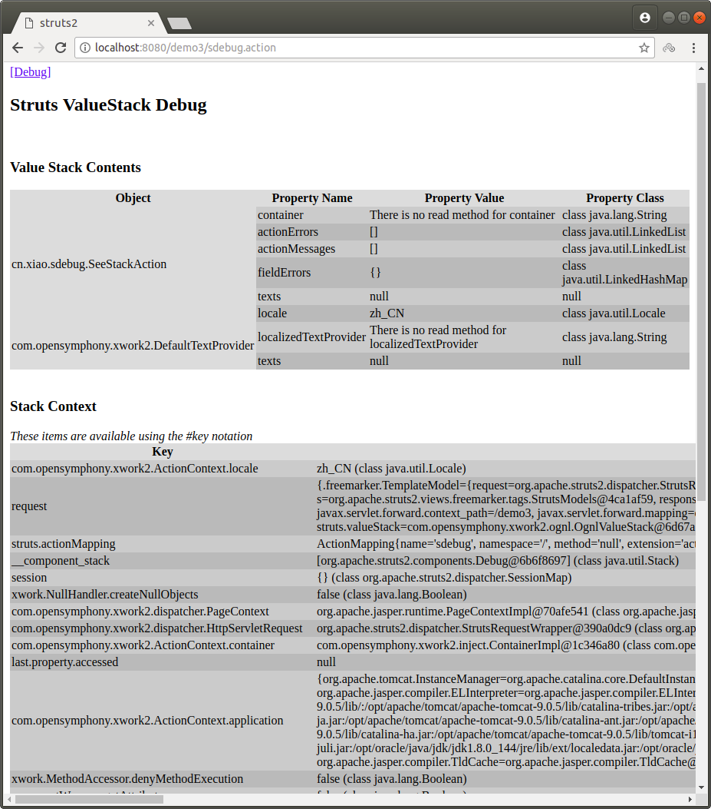
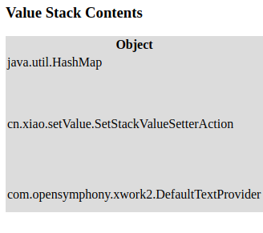
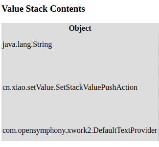
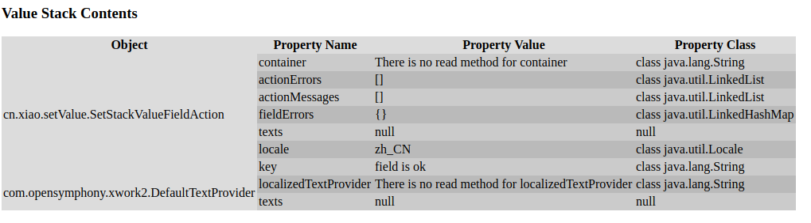

# 值栈
用来存储一些对象，比如request,session,context等。

_use_:demo3

## 如何从页面获取数据
- servlet可以将值存储到域对象中，比如request,session,context，从jsp中获取。
- struts2中，在action存值，存在值栈中，从jsp中获取。
- servlet在第一次被访问时被创建，是单例；action在每次访问时都会被创建，每个action对像都会有一个值栈。

## 如何获取值栈对象
通过`ActionContext.getContext().getValueStack();`来获取。

## 值栈的结构
### 1 查看值栈
_package_:cn.xiao.sdebug  
写一个到达页面的action，页面jsp上开启debug  
_SeeStackAction.java_
```java
public String execute() {
    return SUCCESS;
}
```
_struts.xml_
```xml
<action name="sdebug" class="cn.xiao.sdebug.SeeStackAction">
    <result name="success">/WEB-INF/jsp/helloWorld.jsp</result>
</action>
```

_helloWorld.jsp_
```html
<%-- 引入ognl标签 --%>
<%@taglib prefix="s" uri="/struts-tags" %>
<!-- 开启debug -->
<s:debug/>
```

### 2 结构
可以从上面看到值栈主要有两部分
<div align="center"></div>

#### 2.1 root
就是页面上方的**Value Stack Contents**表，是一个`list`，action没有做任何操作，栈顶元素就是这个action。

#### 2.2 Context
就是下方的表**Stack Context**，是一个`map`，存有:
- request
- session
- ServletContext
- application
- attr : 获取域对象相关的值，都有的话，取域范围最小的值。
- parameters(HttpParameters)


## 向值栈中放值
### 1 简单的值
_package_:cn.xiao.setValue

#### 1.1 使用值栈的setter
使用ValueStack的set方法来设置值，添加一个map对象来保存设置的值。
_SetStackValueSetterAction_
```java
public String execute() {
    System.out.println("SetStackValueSetterAction execute:");
    ValueStack valueStack = ActionContext.getContext().getValueStack();
    valueStack.set("useStackSetter", "it is ok");
    return "debug";
}
```

_struts.xml_
```xml
<global-results>
    <result name="debug">/WEB-INF/jsp/helloWorld.jsp</result>
</global-results>
<action name="useSetter" class="cn.xiao.setValue.SetStackValueSetterAction"/>
```

_index.jsp_
```html
<action name="usePush" class="cn.xiao.setValue.SetStackValuePushAction"/>
```

debug可以看到，在栈顶多了一个Map对象：  
<div align="center"></div>


#### 1.2 使用push
push方法将直接把值加入栈顶。

```java
public String execute() {
    System.out.println("SetStackValuePushAction execute:");
    ValueStack valueStack = ActionContext.getContext().getValueStack();
    valueStack.push("push is ok");
    return "debug";
}
```

_struts.xml_
```xml
<action name="usePush" class="cn.xiao.setValue.SetStackValuePushAction"/>
```

_index.jsp_
```html
<a href="usePush.action">use push</a><br/>
```

一个String对象被加入栈顶：
<div align="center"></div>


#### 1.3 成员变量(常用)
在action中添加一个成员变量，并实现该成员变量的getter，该成员变量便被保存到了值栈中，只是，没有被添加到栈顶，而是保存在action对象中。
```java
// 增加的成员变量
private String key;
// 实现getter
public String getKey() {
    return key;
}

public String execute() {
    // 设置值
    key = "field is ok";
    return "debug";
}
```

_struts.xml_
```xml
<action name="useField" class="cn.xiao.setValue.SetStackValueFieldAction"/>
```

_index.jsp_
```html
<a href="useField.action">use field</a><br/>
```

可以看到action中多一个值：
<div align="center"></div>


## 在页面获取值栈中的值
### 获取使用添加成员变量设置的值
#### 获取字符串
action使用之前的`SetStackValueFieldAction`，然后在页面中使用struts2标签和ognl表达式。
_helloWorld.jsp_
```html
<s:property value="inputString"/>
```


#### 获取对象
- cn.xiao.setValue.SetObjectAction
- struts.xml
- helloWorld.jsp

```html
<h2>获取值栈中对象的值</h2>
<s:property value="user.username"/>
<s:property value="user.password"/>
<s:property value="user.interest[0]"/>
<s:property value="user.interest[1]"/>

```

#### 获取list
- cn.xiao.setValue.SetListAction
- struts.xml
- helloWorld.jsp

```html
<h2>获取值栈中list的值</h2>
<h3>方法一</h3>
<s:property value="users[0].username"/>
<s:property value="users[0].password"/>
<s:property value="users[0].interest[0]"/>
<s:property value="users[0].interest[1]"/>


<s:property value="users[1].username"/>
<s:property value="users[1].password"/>
<s:property value="users[1].interest[0]"/>
<s:property value="users[1].interest[1]"/>

<h3>方法二</h3>
<s:iterator value="users">
    <s:property value="username"/>
    <s:property value="password"/>
    <s:property value="interest[0]"/>
    <s:property value="interest[1]"/>
</s:iterator>

<h3>方法三</h3>
<s:iterator value="users" var="user">
    <s:property value="#user.username"/>
    <s:property value="#user.password"/>
    <s:property value="#user.interest[0]"/>
    <s:property value="#user.interest[1]"/>
</s:iterator>
```
在方法三中，使用了`var`属性，以及`#`来标记。在使用`s:iterator`标签时，会将临时的list存放在Context中，`#`标记将直接从Context中去找，提高一点效率。

#### 获取map
- cn.xiao.setValue.SetMapAction
- struts.xml
- helloWorld.jsp

```html
<h2>获取值栈中map的值</h2>
<s:property value="userMap['user1'].username"/>
<s:property value="userMap['user1'].password"/>
<s:property value="userMap['user1'].interest[0]"/>
<s:property value="userMap['user1'].interest[1]"/>

<s:property value="userMap['user2'].username"/>
<s:property value="userMap['user2'].password"/>
<s:property value="userMap['user2'].interest[0]"/>
<s:property value="userMap['user2'].interest[1]"/>
```


## 获取使用setter设置的值
setter设置的值是有名称的，可以根据名称来获取

### 字符串
- cn.xiao.setValue.SetStackValueSetterAction
- struts.xml
- helloWorld.jsp

```html
<h2>获取使用setter设置的值</h2>
<s:property value="useStackSetter"/>
<s:property value="useStackSetter2"/>
```


## 获取使用push方法设置的值
push方法设置的值是没有名称的，但会值存入到一个叫`top`的栈中，根据这个来取值，但是写法上不同，后push的在前面获取。

### 字符串
- cn.xiao.setValue.SetStackValuePushAction
- struts.xml
- helloWorld.jsp

```html
<h2>获取是用push设置的值</h2>
<s:property value="[0].top"/>
<s:property value="[1].top"/>
```

## ongl中的#和%
### #
上面有用到过一次`#`，实在取list的方法三中遇到。`#`是指定从_Context_中获取值，来提升效率。  
比如，要在struts2标签中获得放在了`request`中的值，就需要使用`#request.key`来获取。

```html
<s:property value="#request.key"/>
```

### %
在struts2__表单标签__中，是不识别ognl表达式，也就是说不能够识别`#request.key`这种写法，那么这里就需要用到`%`，来告诉表单标签，这是一个ognl表达式。

```html
<s:input name="username" value="%{#request.username }">
```
